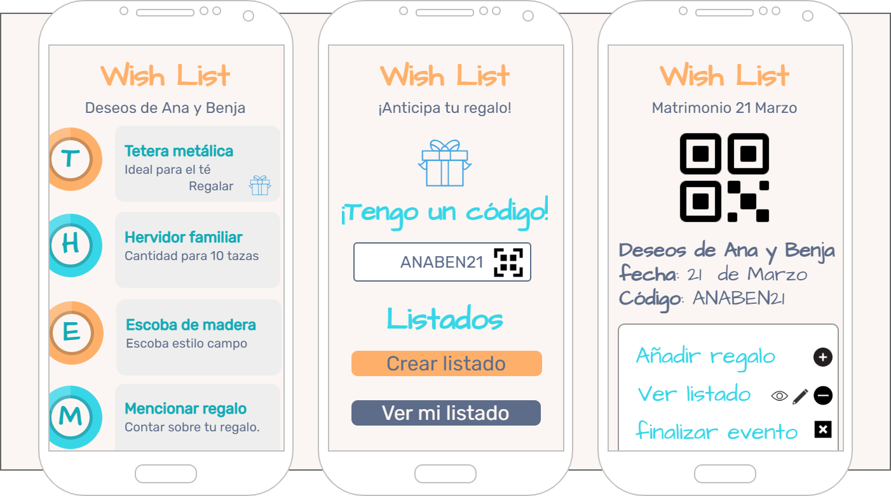

<div align="center">

# Wishlist, el listado de deseos :clinking_glasses:

[](https://marfullsen.github.io/wishlist/)
[](https://v3.vuejs.org/)
[](https://cli.vuejs.org/)
[](https://router.vuejs.org/)
[](https://bulma.io/)
[](https://ionic.io/ionicons)

</div>

<p align="center">
  <a href="https://marfullsen.github.io/wishlist/" rel="noopener">
 </a>
</p>

<p align="center">
  Listado interactivo para ayudar en la elección de los regalos de matrimonio.
</p>

## ⚠️ Sólo diseño FrontEnd ⚠️
**Atención:** Este proyecto es un **diseño visual** (una fachada) orientado a dispositivos móviles, visualizable [aquí](https://marfullsen.github.io/wishlist/).

## ¿Qué es _Wishlist_?

¿Cuántas veces te han llegado los mismos regalos de varios invitados? ¿No sería mejor si les envías un listado interactivo que gestione todos esos problemas? Wishlist es todo eso y más, listados virtuales que evitarán que recibas demasiadas teteras, demasiados tostadores u otros como regalo en cualquier evento.

## Paleta de colores

<p align="center">
  <a href="https://marfullsen.github.io/wishlist/" rel="noopener">
 </a>
</p>

### Código para CSS

```CSS
:root {
  --color-fondo: #fbf6f3;
  --color-primario: #feb06a;
  --color-secundario: #36d6e7;
  --color-auxiliar: #5d6c89;
}

.color-primario {
  color: var(--color-primario);
}

.color-secundario {
  color: var(--color-secundario);
}

.color-auxiliar {
  color: var(--color-auxiliar);
}

.color-fondo {
  color: var(--color-fondo);
}
```

## Vista previa del sitio

<p align="center">
  <a href="https://marfullsen.github.io/wishlist/" rel="noopener">
  </a>
</p>

## Instalación del proyecto
```
npm install
```

### Compilación y recarga rápida para desarrollo.
```
npm run serve
```

### Compilación y minificado para producción.
```
npm run build
```
## Referencias
- [Vista Previa del sitio](https://previewed.app/)